# 📘 Minimal Paper Agent
An agent for autonomously researching, analyzing, and saving paper reports to Obsidian.

## Overview
Based on specified keywords, the agent searches for papers on arXiv, and an LLM (gpt-4o-mini) conducts a deep analysis of the content.

A key feature is that if the agent encounters unfamiliar technical terms or needs implementation details during analysis, it autonomously performs a Web search (DuckDuckGo) to supplement its knowledge and create a detailed explanation.

## 🚀 Workflow
Deep analysis is achieved through an autonomous pipeline process built with LangGraph.

```mermaid
graph TD
    %% ノードの定義
    Start((Start))
    GenQuery[Generate Queries<br><sub>Converts user input to academic queries</sub>]
    FindPapers[Find Papers<br><sub>Retrieves papers from arXiv</sub>]
    
    subgraph Analysis_Phase [Analysis Phase]
        direction TB
        Agent{Agentic Analysis<br><sub>Reads the paper</sub>}
        Tool[🛠️ Web Search<br><sub>DuckDuckGo</sub>]
    end
    
    Compile[Compile Report<br><sub>Creates and saves the report</sub>]
    End((End))

    %% フローの定義
    Start --> GenQuery
    GenQuery --> FindPapers
    FindPapers --> Agent
    
    %% ReActループの表現
    Agent -- "知らない用語がある..." --> Tool
    Tool -- "検索結果" --> Agent
    
    Agent -- "解説完了" --> Compile
    Compile --> End

    %% スタイル
    style Agent fill:#f9f,stroke:#333,stroke-width:2px
    style Tool fill:#bbf,stroke:#333,stroke-width:1px
    style Start fill:#cfc,stroke:#333
    style End fill:#cfc,stroke:#333
```



## ✨ Key Features
- Query Transformation: Automatically converts Japanese input keywords into three patterns of academic English terms optimized for arXiv search, ensuring comprehensive coverage.

- Autonomous Deep Analysis (Agentic Analysis)：When reading a paper abstract, if the agent encounters unknown technical terms or specific method names, it calls a Web search tool to supplement background knowledge before writing the explanation.
- Multi-Source Integration
  - arXiv: Latest academic papers
  - DuckDuckGo: Up-to-date web information, GitHub implementations, and technical blogs

- Knowledge Base Integration: Generated reports are automatically saved to Obsidian (iCloud), building up a personal knowledge base.

## 🛠️ Tech Stack
- Language: Python 3.10+
- Orchestration: LangGraph
- LLM: OpenAI API (gpt-4o-mini)
- Search: arxiv API, duckduckgo-search
- CLI: Typer

Package Manager: uv

## 📦 How To Use
We recommend using uv as the package manager.

- Clone the repository

```bash
git clone <repository-url>
cd minimal-agent
```

- Configure Environment Variables: Create a .env file and set your OpenAI API key.
```bash
echo 'OPENAI_API_KEY="sk-your-api-key-here"' > .env
```

- Install Dependencies
```bash
uv venv
uv pip install -p pyproject.toml
```

- Configure Obsidian Path (Optional): Modify the obsidian_path variable in main.py to match your environment.

## 💻 Usage
Simply pass the "topic you want to research" as a command-line argument. Japanese input is accepted!

```bash
uv run python main.py "Example <Mixture of Experts>"
```

Japanese Input Accepted (Automatically translated)🙆‍♀️

```bash
uv run python main.py "LLMの推論高速化"
```

## 📄 Example Output Report
The generated Markdown report includes the following information:
- List of executed search queries: Keywords used for arXiv search
- Web search log: History of what the agent searched for during analysis
- Paper Details:Title / URL
- Core Contribution (Detailed explanation supplemented by web search)